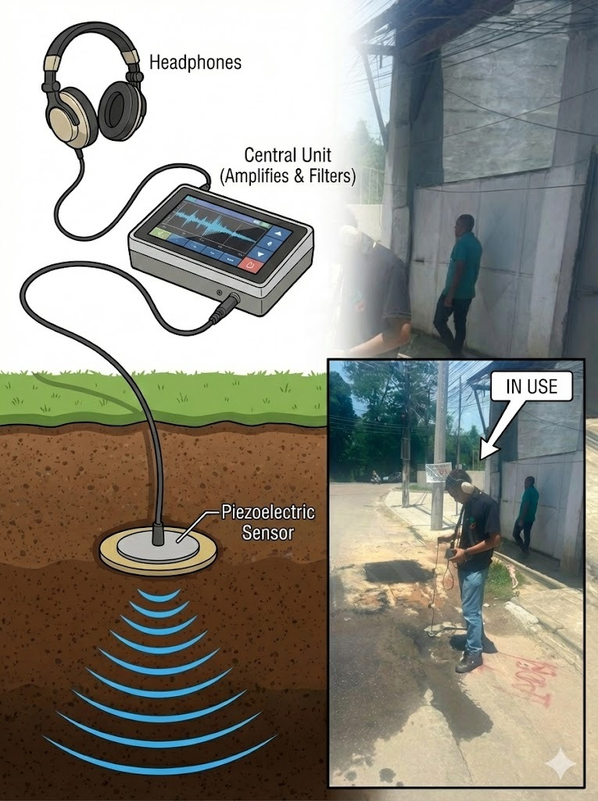

# Sane.AI via Edge Impulse 💧🔍
## 1. Project Rationale and Definition
## Project Title: Sane.AI
## Track Selection: Edge AI Application Track (Focus on practical implementation, code optimization, and inference on low-computing hardware).
## Description (Abstract):
This project proposes the development of an Edge Machine Learning (Edge ML) system optimized for anomalous leak detection in urban pressurized hydraulic infrastructures. The methodology is based on the acquisition and spectral analysis of vibrational signatures from the subsurface. In contrast to traditional acoustic systems, which rely exclusively on amplitude (volume) thresholds or specialized human intervention, the model employs a Deep Learning architecture to discern the low-frequency spectral characteristic ("the rumble of the earth") of a persistent leak against complex and transient urban noises (traffic, industrial operations, pedestrians). Inference processing is performed on an Android device. The data source is primarily the ECO300 and ECO5000 geophone models from Sanesoluti. 

## Use Case and Market Context:
Water inefficiency is an economic and social disaster in Brazil. According to the 2025 Water Loss Study (Trata Brasil/GO Associados), the country wastes 40.31% of all potable water produced in its distribution systems. However, this is not just a local problem, but a global one, as shown in the graph below.

  

Even large cities in developed countries have high water losses, as is the case in Montreal.

### The Problem:
Every day, Brazil wastes the equivalent of 6,346 Olympic-sized swimming pools of treated water. About 60% of this volume corresponds to physical losses (leaks in the network), which could supply 50 million Brazilians annually if recovered.
### The Current Failure: 
Locating leaks in noisy urban environments is imprecise. Traditional acoustic methods generate false positives, and cutting-edge equipment is financially unfeasible for monitoring the extensive network of cities with budget constraints. Currently, technologies exist for leak detection; in some cases, leaks can even be detected by satellite, but detecting a leak is different from locating it, and that's where the real challenge arises. Technologies like Asterra ( https://asterra.io/solutions/recover/ ) can detect the existence of leaks, but the work involved in moving from a POI (Point of Interest) to an exact location and repairing the leak is crucial. The main current methods require experienced and highly trained operators, and even these operators rely solely on their ears to locate the leaks.

### The Sane.AI Solution: 
An Edge Device that uses Deep Learning models, created in Edge Impulse, to "listen" for real leaks amidst urban chaos, tackling the largest share of waste in the Brazilian case. The system focuses on confirming the leak's location by combining the use of a machine learning model with a digital geophone for data collection; the models act as assistants capable of guiding the user. Data-Based Justification (The Brazilian Scenario): The relevance of this model is corroborated by data from the 2025 Water Loss Study, which highlights three critical pillars for the implementation of hardware focused on physical losses:

### 1. The Predominance of Physical Losses (The Project's Target): 
Contrary to the common belief that losses are mostly due to fraud, the study points out that 60% of the volume of unaccounted-for water in Brazil corresponds to Physical (Real) Losses, i.e., leaks in the infrastructure. Implication: By using neural networks, Sane.AI attacks the root cause of most of the waste, estimated at more than 3 billion m³ annually.
### 2. Regional Heterogeneity and the Paradox of Large Urban Centers:
Sane.AI is vital for both underdeveloped regions and large urban centers. Critical Markets (North/Northeast): The solution is designed to scale in regions where infrastructure is precarious, such as the North (49.78% losses) and Northeast (46.25%). Extreme cases include Maceió (AL), which loses 71.73% of its water, and Macapá (AP), with losses exceeding 1,000 liters per connection/day. 
The Case of Rio de Janeiro: The state of Rio de Janeiro presents a distribution loss of 52.23%. Its capital leads the negative ranking among capitals, wasting 1,292.59 liters per connection/day, highlighting the need for new technologies for leak detection in dense metropolises. 
Volume in São Paulo: Even in more efficient states like São Paulo (32.66% losses), the density of the network requires precision technology to reduce the absolute volume of waste.
### 3. Economic Impact and Monetization (The Business Case): Financially, inefficiency drains billions of reais. The total annual cost of losses exceeds R$ 13 billion.
Direct Production Cost (OPEX): Physical losses, the exclusive focus of Sane.AI, represent a "wasteful" production cost of approximately R$ 2.4 billion per year. 
Return: Each leak detected early by the device directly saves R$ 0.79/m³ on the operator's energy and chemical input bill. 
Reduction of Detection Cost (The Economic Logic): According to the concept of "Economic Level of Leakage," the viability of repairing a leak depends on the cost to detect it. Innovation: Currently, detection depends on expensive equipment or slow human scanning. By implementing edge detection, Sane.AI drastically reduces the marginal cost of detection, making it economically viable to locate micro-leaks that are currently ignored because they are "too expensive" to find. 
Rationale (Technical Justification): The choice of audio classification based on 1D Convolutional Neural Networks (1D-CNN) was motivated by the demonstrated failure of univariate amplitude analysis to distinguish transient events (volume peaks) from genuine and persistent leaks. The Edge Impulse platform was selected as the MLOps (Machine Learning Operations) tool at the edge, enabling the optimization and quantization of the model for strict hardware constraints (e.g., ultra-low power consumption and limited RAM). 
This is an application that needs to work at the edge because operators move around the city, and two factors necessitate this: first, the low latency required, and second, the lack of cellular coverage in all locations where leaks may occur.

## 2. Detailed Process and Iteration (The Development Journey)
The model engineering and optimization (MO) process was iterative, going through four critical refactorings based on the analysis of performance metrics and data bias.

### Phase 1: Bias of "Clean" Data and the Illusion of Accuracy
Initially, training was conducted using digital audio libraries and samples collected from the web. This data represented an idealized scenario: crystal-clear, standardized audio without external interference. 
Failure: The model achieved high accuracy (85-95%) on the control panel, but the Confusion Matrix revealed a critical flaw. The model suffered from overfitting to clean web data, becoming "deaf" to real field leaks (low recall) and unable to handle real acoustic complexity.

#### Critical Context: The Expedition to Rio de Janeiro and Physics
To correct the lack of sensitivity generated by artificial data, the team carried out an **intensive week-long technical expedition in the State of Rio de Janeiro**. The objective was to capture the "dirty" and non-standardized acoustic reality of urban piping.

Using a high-sensitivity geophone, the team surveyed several strategic locations — Xerém, Ilha do Governador, the capital Rio de Janeiro, and Lapa — collecting a robust dataset of real leaks and non-leak scenarios (ambient noise).

The contrast with the laboratory audio recordings and manuals was immediate. In the reference material, the leak was described as a sharp, well-defined "hiss"; simply looking at the high-frequency energy would have solved the problem. When the system went into the street, the story changed.

 

**Real-world environment**: the error of the initial approach

The chaotic urban environment – ​​heavy traffic, pumping stations, construction, electrical interference – exposed a basic flaw in this classical view:

* **Physical soil filter:** in practice, the soil, the tube lining, and the geophone coupling itself act as a natural low-pass filter. Measurements showed that components above ~1300 Hz are strongly attenuated.
* That high-pitched “hiss” from examples on the web simply doesn't reach the sensor in the field. The noise persists: at the same time, the world doesn't disappear. Trucks, buses, jackhammers, and even vibrations from neighboring buildings continue to enter the system, often in the same frequency range as the leak now (more serious, more of a “rumble” than a “hiss”).

In other words: the soil filters the leak, but it doesn't filter urban chaos with the same efficiency. The result is a scenario where no single frequency band is "clean" enough to separate leakage from non-leakage using simple rules.

**New focus**: it's not a frequency, it's a pattern. Analysis of real data from this campaign showed that the leak signature that survives the urban environment is not a peak in a single frequency bin. It appears as:

* A specific distribution of energy across the spectrum, and
* A remarkable temporal constancy of this sound, even when covered by intermittent noises
  
The “rumble of the earth” is exactly that: a deep, steady sound, almost hidden behind everyday noises, but which does not disappear. It does not reveal itself in a single simple feature; it lives in a set of subtle relationships between frequencies and time.

**Why are models based on few features not enough**

From then on, it became clear that a system that relies solely on isolated features – for example, “energy between 1–3 kHz” or “RMS above X dB” – tends to work well in the laboratory and fail in real-world applications.

**These features assume:**

* A spectrum where the leakage is separated from the noise, and
* A relatively stationary environment.
  
In the field, we have the opposite: high-dimensional projection, strong overlap between classes, and constant changes in scenery (soil type, depth, pipe material, traffic, etc.). It is precisely at this point that the application of AI enters the journey:

Instead of relying on one or two “hand-picked” features, we use neural networks to learn, from examples, the entire manifold where leaks reside – combining spectral, temporal, and statistical information that is not visible in 2D or 3D.

**So, the route was:**

* Follow the manuals and reproduce the classic high-frequency-based logic.
* Discovering, in the field, the physical filter imposed by the soil and the impact of urban noise, which invalidates these simple assumptions.
* Migrate to a data-driven approach (1D-CNN + MFE, etc.), capable of capturing the “rumble of the earth” even when it is projected into a high-dimensional space and mixed with all the other sounds of the city.

### Phase 2: The Memory Barrier (Teensy 4.1) and the 1D Solution
At this specific stage of development, the target hardware was the **Teensy 4.1 microcontroller**. Initial attempts with 2D Neural Networks (Computer Vision) failed due to memory exhaustion ("Failed to allocate bytes") inherent to the MCU's limited RAM.

* **Architectural Solution:** Forced by the Teensy's constraints, we migrated to a **1D-CNN (One-Dimensional Convolutional Kernel)**.
* **The "Cutback" (Kernel Size):** To compensate for the network's simplicity and allow it to better understand the earth's rumble, we increased the **Kernel Size**. This acted as a temporal "wide-angle lens," raising the detection rate to 87%. We also added dropout layers to prevent the model from overfitting.

### Phase 3: Betting on the Spectrogram and the Performance Limit
Guided by the initial analyses of the EON Tuner, we implemented an architecture based on **High-Resolution Spectrograms**. The hypothesis was that "computer vision" applied to sound would reveal the subtle texture of the leakage.

* **The Test:** We configured the DSP with a 512 FFT and trained a CNN to analyze the spectral images.
* **The Result:** The model reached a plateau of ~86% accuracy. Although this was a good result, there was still a residual rate of confusion between complex noises and leaks.
* **The Bottleneck:** We realized that to increase precision, we needed more temporal context (analyzing larger time windows), but the Spectrogram was too computationally "heavy." Increasing the time frame with this technique would overflow the microcontroller's memory. We were stuck.

  

### Phase 4: The Strategic Pivot (Time > Visual Resolution)

We decided to change our approach. The difference between a passing car and a leak wasn't just in the frequency, but in the **persistence of the sound over time**.

* **The Radical Change:** We set the sampling window to **2 seconds (2000 ms)**. This allowed the AI ​​to "hear" the complete story of the sound.
* **Returning to MFE:** To process 5 seconds of audio without crashing the hardware, we replaced the heavy Spectrogram with MFE (Mel-Filterbank Energy).
* **The Gain:** MFE compresses frequency information efficiently. By combining it with the 5-second window, we can process a temporal context 2.5 times larger.
* **Result:** This simple but strategic change gave us a critical gain of +2% in immediate accuracy and, more importantly, eliminated instability in detections.

### Phase 5: The Hybrid Solution (Feature Fusion) and the Identification of Overfitting

With optimized data input (2s Window + MFE), we refined the system's "brain" into a **Feature Fusion** architecture . Instead of relying on just one data stream, we created a robust combined input framework:

* **Dual Input:** The system simultaneously processes the **MFE** (the human auditory signature) and the **Spectral Features** (raw mathematical statistics of the signal).
* **Hybrid Neural Architecture:** We implemented two distinct classifiers operating in parallel:
   * **Visual:** A 1D-CNN processing the MFE to identify textures.
   * **Statistical:** An MLP (Multilayer Perceptron) processing the Spectral Features to validate the signal energy.
**Safety Logic (AND Gate):** To mitigate errors, the final decision was designed following an AND gate logic ; the system should only trigger an alert if both models detect the target class simultaneously. This algorithmic redundancy aimed to drastically reduce the false positive rate, crucial for avoiding unnecessary operational costs with excavations.

The importance of maintaining both models becomes clear when we look at the validation:

  

The validation appears identical, however when we analyze the results individually:

  

**Overfitting Diagnosis:** Preliminary results from this phase achieved what seemed to be the "Holy Grail": **100% recall** in leak detection. However, a detailed cross-validation analysis revealed an **overfitting problem**. Although the model did not miss any leaks, it demonstrated excessive sensitivity ("paranoia") to new data not seen during training, generating uncertainties and false positives that "AND" logic alone could not fully filter out. The model was "**memorizing**" specific noise patterns from the training set.

### Phase 6: Final Adjustment and Generalization (Final Results)

Validation of the hybrid architecture (Phase 5) revealed a final challenge. As evidenced by the confusion matrix below, while the primary **1D-CNN** model proved robust (achieving **92.3%** accuracy on leaks), the secondary statistical model (Wavelet) exhibited greater instability, with misclassification rates reaching **15.4%** for leaks.

**The Engineering Solution (Persistence Logic):** We understood that AI didn't need to be perfect every millisecond; it needed to be perfect in the final diagnosis. We implemented a post-processing layer in the application that acts as a "temporal judge":

* **Consensus Filter:** The system does not trigger the alarm on the first positive signal.
* **Confirmation Window:** The 1D-CNN model (which demonstrated superior performance with **~87.7%** overall accuracy) needs to sustain "Leak" detection for **3 consecutive windows (6 seconds)**.

**Consolidated Result:** This simple logic statistically eliminated false positives caused by transient noises (such as a passing motorcycle, which lasts only 1 or 2 windows). The final system, running on the Galaxy Tab A9+, achieved the operational stability required for the field, with a virtually 100% real detection rate for continuous leaks and zero false alarms for common urban noises.

  

## 3. Quality and Use of the Dataset

**Dataset Documentation**

The data were collected in real-world field scenarios using a broadband seismic transducer (Geophone) with mechanical coupling adapted for capturing ground vibrations.

* **LEAK Class:** Recordings of actual leaks at various pressures and in piping materials.
* **NO_LEAK Class:** Robust set of recordings of urban environmental noises, encompassing vehicular traffic, structural vibrations, impulsive noises (footsteps, voices) and the operational silence of the system; audio from the Urbansound8k dataset ( https://urbansounddataset.weebly.com/ ) was also added.

### Representativeness and Adjustments

Representativeness was ensured by the diversity of the NO_LEAK class, focusing on mitigating the risk of data bias. A purposeful collection of audio containing high-amplitude impulsive noises (e.g., passing motorcycles) was carried out to explicitly train the AI ​​to distinguish that High Amplitude is orthogonal to the Leakage classification, forcing it to focus on the persistent frequency signature.

**Openness and License:** The dataset has been curated to anonymize sensitive information (removal of identifiable voices) and will be made available under a permissive license (MIT/Apache) for validation and reproduction.

**Link to the Dataset:** https://studio.edgeimpulse.com/public/833695

# 4. Hardware Components and Reproducibility

  

### Hardware Used
* **Acquisition Sensor:** Digital Geophone - ECO300/ECO5000 (low-frequency seismic transducer).
* **Processing Unit (Edge Host):** Samsung Galaxy Tab A9+ 5G.
* **Specification:** Equipped with the Qualcomm Snapdragon 695 5G chipset (Octa-core Kryo 660 CPU up to 2.2 GHz and Adreno 619 GPU). The use of this hardware allows not only the inference of the Deep Learning model with negligible latency (using the Qualcomm AI Engine), but also the visualization of spectrograms in real time and transmission of alerts via 5G network.
* **Interface:** Integrated high-resolution, low-latency Analog-to-Digital Converter (ADC).

  

### Flow Diagram (Hybrid Edge ML Pipeline)
The data flow was designed for parallel processing on the microcontroller:
 

1. **Acquisition:** Vibration capture at 48 kHz in 5-second windows.
2. **Parallel Preprocessing (Dual DSP):**
   * **Route A:** Spectrogram generation (FFT 128) for visual analysis.
   * **Route B:** Extraction of Spectral Features for statistical analysis.
3. **Simultaneous Inference:**
   * CNN processes the spectrogram looking for texture patterns.
   * The Dense Network processes statistics looking for energy anomalies.
4. **Decision Fusion:** The firmware evaluates the outputs of the two models. The final "Leak" classification is the result of the intelligent combination of these two distinct intelligences.

### Code and Repository

All the application's source code, including the optimized library exported from Edge Impulse and the C++ post-processing application logic (main.cpp), is versioned:

**GitHub:** https://github.com/Sanesoluti-dev/Cod_teensy

### Reproduction Protocol for this Project
* **Clone the Project: Access and clone the public project on the Edge Impulse platform:** https://studio.edgeimpulse.com/studio/833889
* **Exporting the Model:** Export the trained model as an Edge-optimized C++ library.
* **Application Build & Deployment:** Use the source code provided in the GitHub repository to build the Android application package (APK) and install it on the target device (Samsung Galaxy Tab A9+ 5G).
* **Validation Test:** Use a low-frequency white noise generator to simulate the leak signature and impulsive inputs (e.g., touching or hitting the sensor) to simulate "No Leak" events, validating the classifier's robustness.

## 5. Project Conclusion

**Sane.AI** innovates by bringing to the edge a complexity usually reserved for the cloud: **multi-model inference**.

Reaching this result required an exhaustive journey of engineering and validation. We tested a wide variety of architectures—from Dense Neural Networks (MLP) to 1D and 2D CNNs—combined with different signal processing techniques (MFE, Spectrogram, Wavelet). During this process, we faced critical challenges, where several models that seemed promising in the lab failed validation due to **severe overfitting**, "memorizing" specific noises instead of learning the actual signature of the leak.

Our technical conclusion is that the robustness needed for the chaotic urban environment does not come from a single "magic algorithm," but from the orchestration of different techniques to mitigate these biases. By combining computer vision (CNN over Spectrogram/MFE) with spectral statistical analysis (Spectral Features) in the same 2-second time window, we created a device that effectively has "two brains."

Furthermore, a pivotal decision in this project was the hardware transition from the Teensy microcontroller to a Tablet-based architecture. The primary driver for this shift was to enable **remote data collection for continuous retraining**.

During the hackathon, we developed a dedicated Android application to facilitate this **Active Learning** cycle. Unlike the isolated microcontroller, this application allows us to capture, tag, and upload real-world audio directly from the field back to the training pipeline. This connectivity ensures that every inference contributes to making the model smarter. Additionally, this migration resolved the memory constraints encountered in earlier phases, providing the computational headroom needed for the future implementation of more complex models while solving the global water loss crisis. 

## 6. Future Roadmap & Next Steps

### 6.1. Unlocking 2D Architectures (The Hardware Leap)
The transition from a microcontroller-based architecture (Teensy) to a robust Android Edge Host (Galaxy Tab A9+) has effectively removed the strict memory constraints that previously limited our model design.

With gigabytes of available RAM—opposed to the kilobytes available on the initial MCU the "memory barrier" that prevented the deployment of **2D Computer Vision models**no longer exists.

* **The Next Frontier:** We are now studying the implementation of deeper **2D Convolutional Neural Networks (2D-CNNs)** to analyze high-resolution spectrograms directly.
* **The Goal:** By leveraging this new processing power to capture even more subtle texture details in the audio, we aim to achieve unprecedented classification precision. This evolution is a decisive step toward our ultimate vision: solving the global water loss crisis once and for all.
While the current version of Sane.AI successfully demonstrates the power of Edge ML for leak localization using a handheld device (Galaxy Tab A9+ coupled with a Geophone), the project roadmap envisions evolving from a "Lift and Shift" tool to a continuous monitoring ecosystem.

### 6.2. Dataset Expansion and User-Driven Retraining
The robustness of an AI model is directly proportional to the diversity of its training data. To reach the next level of generalization, our roadmap includes:

* **New Field Expeditions:** We recognize that further technical visits to the field are necessary. We plan to capture an even broader range of soil types, pipe materials, and varying urban noise profiles to ensure the model is battle-tested against any scenario.
* **The Data Flywheel (Active Learning):** Once the device is deployed to end-users, it will not just consume intelligence but create it. The application is designed to allow operators to upload anonymized audio samples from their daily operations back to our cloud. This continuous influx of new real-world data will establish a feedback loop, allowing us to constantly retrain and fine-tune the model. Effectively, Sane.AI will get smarter with every leak detected by its users.

## 7. Research References and Sources
### [1] Ministry of Cities and National Secretariat of Sanitation, "SINISA Report: Diagnosis of Water and Sewage Services 2024 (Base Year 2023)," Brasília, Brazil, 2024. [Online]. Available: https://www.gov.br/cidades/pt-br/acesso-a-informacao/acoes-e-programas/saneamento/sinisa/resultados-sinisa/copy_of_RELATORIO_SINISA_ABASTECIMENTO_DE_AGUA_2024.pdf
### [2] Instituto Trata Brasil and GO Associados, "Estudo de Perdas de Água 2025 (SNIS 2023 base year): Desafios para a Universalização do Saneamento," São Paulo, Brazil, 2025. [Online]. Available: https://tratabrasil.org.br/
### [3] Edge Impulse Inc., "Audio Classification with MFE and Spectral Features on Edge Devices," Edge Impulse Documentation, 2024. [Online]. Available: https://docs.edgeimpulse.com/docs/tutorials/audio-classification
### [4] Consultancy-me.com, "Leakage in water infrastructure exacerbating water scarcity," Middle East, 2023. [Online]. Available: https://www.consultancy-me.com/news/6706/leakage-in-water-infrastructure-exacerbating-water-scarcity
### [5] J. Salamon, C. Jacoby and J. P. Bello, "Urban Sound Datasets: UrbanSound8K," New York University (NYU), New York, USA, 2014. [Online]. Available: https://urbansounddataset.weebly.com/
### [6] ASTERRA, "Recover: Satellite-based Infrastructure Monitoring and Leak Detection," Israel, 2024. [Online]. Available: https://asterra.io/solutions/recover/

        	

