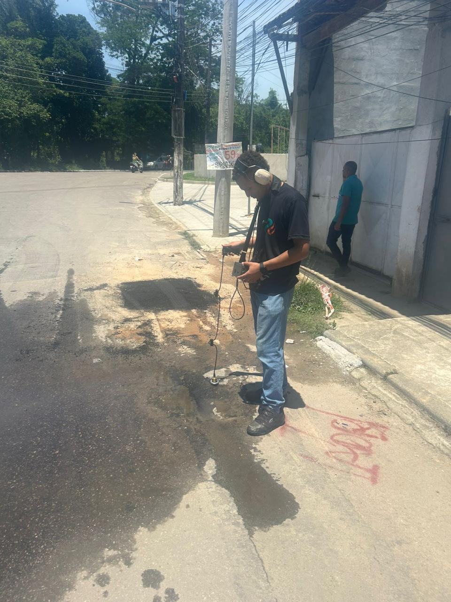
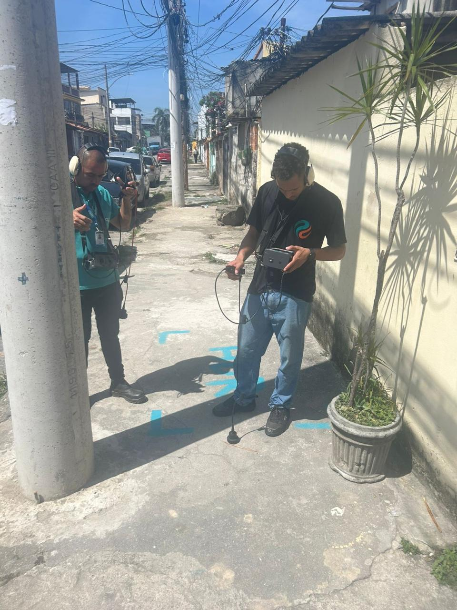
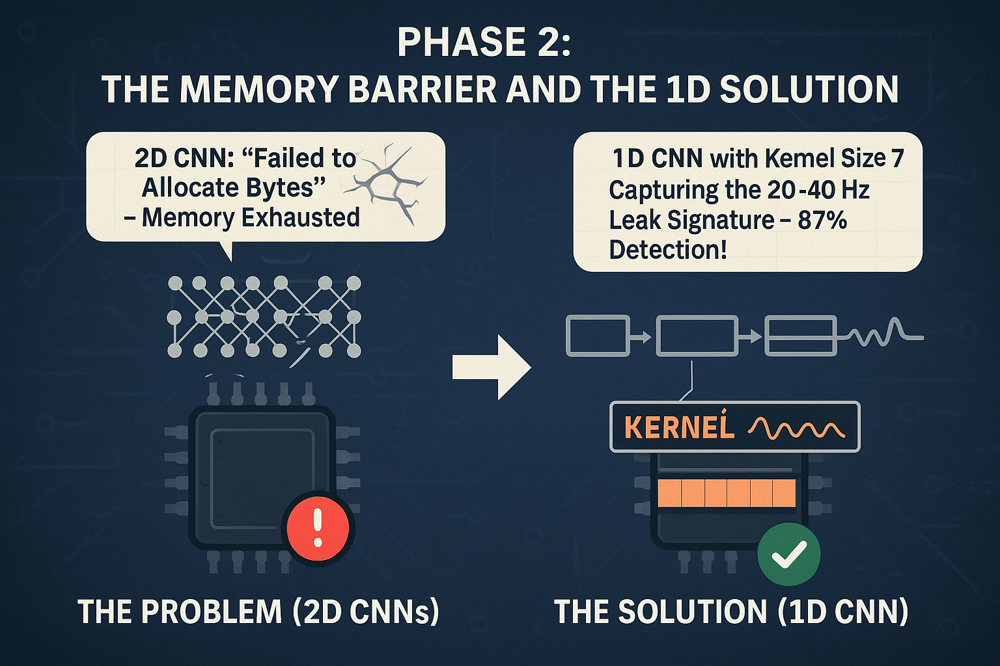
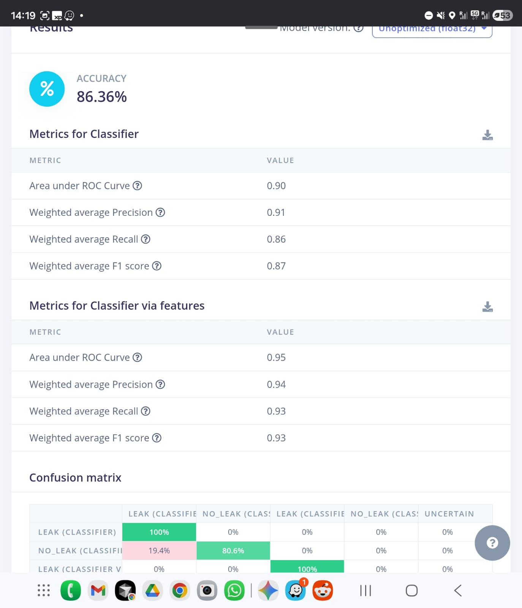
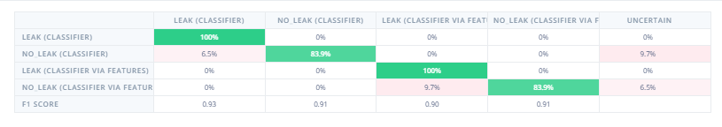
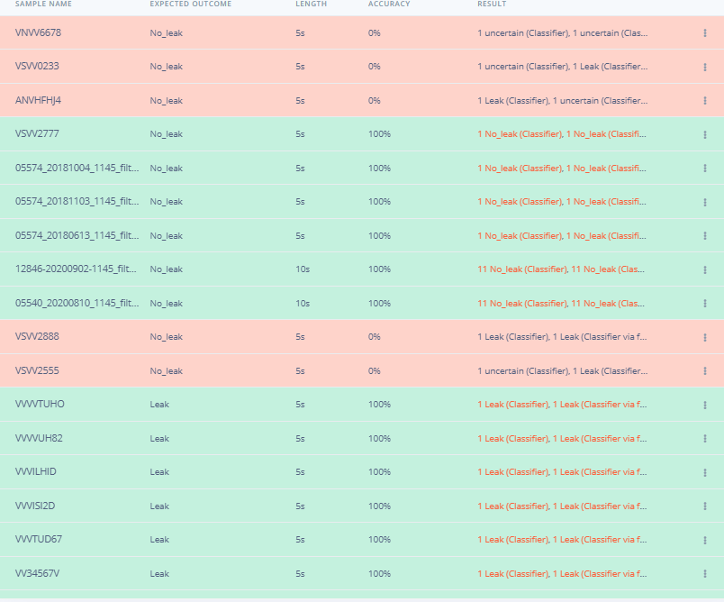
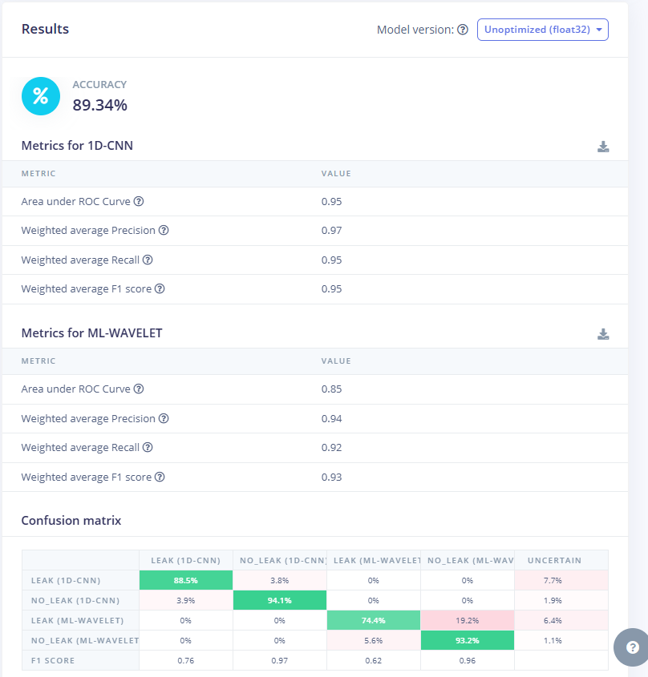
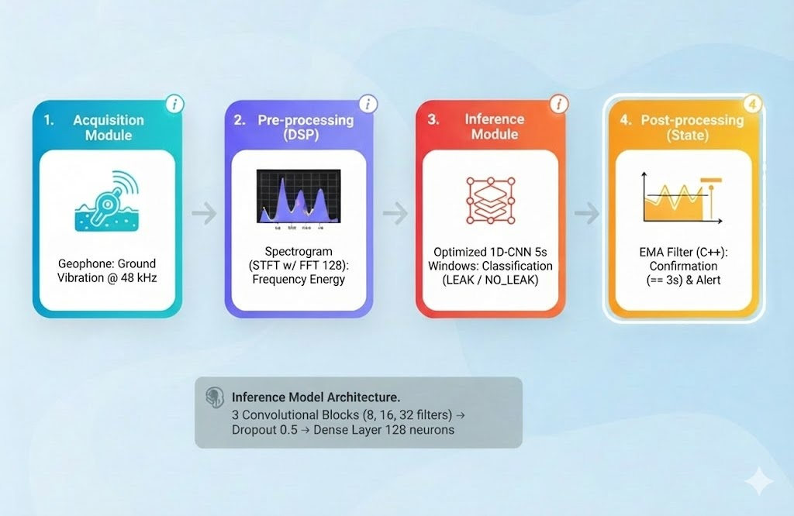

# Sane.AI via Edge Impulse 💧🔍
## 1. Racional e Definição do Projeto
## Título do Projeto: Sane.AI
## Seleção da Trilha: Edge AI Application Track (Foco na implementação prática, otimização de código e inferência em hardware de baixo poder computacional).
## Descrição (Abstract):
Este projeto propõe o desenvolvimento de um Sistema de Aprendizado de Máquina em Borda (Edge ML) otimizado para a detecção anômala de vazamentos em infraestruturas hidráulicas pressurizadas urbanas. A metodologia baseia-se na aquisição e análise espectral de assinaturas vibracionais do subsolo. Em contraste com os sistemas acústicos tradicionais, que dependem exclusivamente de limiares de amplitude (volume) ou da intervenção humana especializada, o modelo emprega uma arquitetura de Deep Learning para discernir a característica espectral de baixa frequência ("o ronco da terra") de um vazamento persistente contra ruídos urbanos complexos e transientes (tráfego, operações industriais, pedestres). O processamento da inferência é realizado em um dispositivo Android. A fonte dos dados é primariamente os geofones modelos ECO300 e ECO5000 da Sanesoluti. 

## Caso de Uso e Contexto de Mercado: 
A ineficiência hídrica é um desastre econômico e social no Brasil. Segundo o Estudo de Perdas de Água 2025 (Trata Brasil/GO Associados), o país desperdiça 40,31% de toda a água potável produzida nos sistemas de distribuição.
Porem este não é um problema apenas local, mas sim o case global, vejamos o grafico abaixo 

https://www.statista.com/chart/4528/some-cities-suffer-enormous-water-losses-every-year/

Mesmo grandes cidades em paises desenvolvidos tem altas perdas de água como é o caso de Montreal

### O Problema:
Diariamente, o Brasil joga fora o equivalente a 6.346 piscinas olímpicas de água tratada. Cerca de 60% desse volume corresponde a perdas físicas (vazamentos na rede) , que poderiam abastecer 50 milhões de brasileiros anualmente se recuperadas.
### A Falha Atual: 
A localização desses vazamentos em cenários urbanos ruidosos é imprecisa. Métodos acústicos tradicionais geram falsos positivos e equipamentos de ponta são financeiramente inviáveis para monitorar a extensa malha de cidades com restrições orçamentárias.
Atualmente existem tecnologias para a deteccção de vazamentos, os mesmos em alguns casos podem até ser detectados por satélite, mas detectar o vazamento é diferente de localizar o vazamento e ai que o real desafio surge. Tecnologias como o Asterra (https://asterra.io/solutions/recover/) conseguem detectar a existência de vazamentos, mas as botas no chão para sair de um POI (Point of interest) para uma localização exata e o reparo do vazamento é crucial, os principais métodos atuais requerem operadores experientes e altamente capacitados, e mesmo esses operadores dependem apenas de seus ouviodos para localizar esses vazamentos. 

### A Solução Sane.AI: 
Um dispositivo de Borda (Edge Device) que utiliza modelos de Deep Learning, criados no Edge Impulse, para "ouvir" o vazamento real em meio ao caos urbano, atacando a maior fatia do desperdício no caso brasileiro.
O sistema foca na confirmação da localização do vazamento combinado o uso de um modelo de ML com um geofone digital para captação de dados, os modelos funcionam como auxiliares capazes de orientar o usuário
Justificativa Baseada em Dados (O Cenário Brasileiro): A relevância desse modelo é corroborada pelos dados do Estudo de Perdas de Água 2025, que evidenciam três pilares críticos para a implementação de hardware focado em perdas físicas:

### 1. A Predominância das Perdas Físicas (O Alvo do Projeto): 
Ao contrário do senso comum de que as perdas se devem majoritariamente a fraudes, o estudo aponta que 60% do volume de água não faturada no Brasil corresponde a Perdas Físicas (Reais), ou seja, vazamentos na infraestrutura
Implicação: O Sane.AI, ao utilizar redes neurais, ataca a causa raiz da maior parte do desperdício, estimada em mais de 3 bilhões de m³ anuais.
### 2. Heterogeneidade Regional e o Paradoxo dos Grandes Centros: 
O Sane.AI é vital tanto para regiões não desenvolvidas quanto para grandes centros urbanos.
Mercados Críticos (Norte/Nordeste): A solução é desenhada para escalar em regiões onde a infraestrutura é precária, como o Norte (49,78% de perdas) e Nordeste (46,25%). Casos extremos incluem Maceió (AL), que perde 71,73% de sua água , e Macapá (AP), com perdas superiores a 1.000 litros por ligação/dia.
O Caso do Rio de Janeiro: O estado do RJ apresenta perda na distribuição de 52,23%. Sua capital lidera o ranking negativo entre as capitais, desperdiçando 1.292,59 litros por ligação/dia, evidenciando a necessidade de novas tecnologias para detecção de vazamentos em metrópoles densas.
Volume em São Paulo: Mesmo em estados mais eficientes como São Paulo (32,66% de perdas), a densidade da malha exige tecnologia de precisão para reduzir o volume absoluto de desperdício.
### 3. Impacto Econômico e Monetização (O Business Case): Financeiramente, a ineficiência drena recursos bilionários. O custo total anual com perdas supera R$ 13 bilhões.
Custo Direto de Produção (OPEX): As Perdas Físicas, foco exclusivo do Sane.AI, representam um custo de produção "jogado fora" de aproximadamente R$ 2,4 bilhões ao ano.
Retorno: Cada vazamento detectado precocemente pelo dispositivo economiza diretamente R$ 0,79/m³ na conta de energia e insumos químicos da operadora.
Redução do Custo de Detecção (A Lógica Econômica): Conforme o conceito de "Nível Econômico de Vazamento", a viabilidade de reparar um vazamento depende do custo para detectá-lo.
Inovação: Atualmente, a detecção depende de equipamentos caros ou varredura humana lenta. Ao implementar uma detecção na borda, o Sane.AI reduz drasticamente o custo marginal de detecção, tornando economicamente viável a localização de micro vazamentos que hoje são ignorados por serem "caros demais" para encontrar.
Racional (Justificativa Técnica): A escolha pela classificação de áudio baseada em Redes Neurais Convolucionais 1D (1D-CNN) foi motivada pela falha demonstrada na análise univariada de amplitude para distinguir eventos transitórios (picos de volume) de vazamentos genuínos e persistentes. A plataforma Edge Impulse foi selecionada como ferramenta de MLOps (Machine Learning Operations) em Borda, viabilizando a otimização e a quantização do modelo para restrições estritas de hardware (ex: consumo de potência ultra baixo e memória RAM limitada).
Este é uma aplicação que precisa funcionar na borda, porque os operados andam por todos os locais das cidades, e dois fatores obrigam essa necessiadade, o primeiro a baixa latÊncia requerida e segundo a falta de cobertura celular em todos os locais que os vazamentos podem aparecer.

## 2. Detalhamento do Processo e Iteração (A Jornada de Desenvolvimento)
O processo de engenharia e otimização do modelo (M.O.) foi iterativo, passando por quatro refatorações críticas baseadas na análise de métricas de desempenho e viés de dados (data bias).

### Fase 1: O Viés de Dados "Limpos" e a Ilusão da Acurácia
Inicialmente, o treinamento foi realizado utilizando bibliotecas de áudio digitais e amostras coletadas na web. Estes dados representavam um cenário idealizado: áudios cristalinos, padronizados e sem interferências externas.
Falha: O modelo atingiu alta acurácia (85-95%) no painel de controle, mas a Matriz de Confusão revelou a falha crítica. O modelo sofreu de Overfitting aos dados limpos da web, tornando-se "surdo" para vazamentos reais em campo (baixo Recall) e incapaz de lidar com a complexidade acústica real.
#### Contexto Crítico: A Expedição ao Rio de Janeiro e a Física
Para corrigir a falta de sensibilidade gerada pelos dados artificiais, a equipe realizou uma **expedição técnica intensiva de uma semana no Estado do Rio de Janeiro**. O objetivo foi capturar a realidade acústica "suja" e não padronizada das tubulações urbanas.

Utilizando um Geofone de alta sensibilidade, a equipe percorreu diversas localidades estratégicas — Xerém, Ilha do Governador, a capital Rio de Janeiro e a Lapa — coletando um dataset robusto de vazamentos reais e cenários de não-vazamento (ruídos ambientes).

O contraste com os áudios de laboratório e dos manuais foi imediato. No material de referência, o vazamento era descrito como um “chiado” agudo e bem definido; bastava olhar a energia em alta frequência e o problema estaria resolvido. Quando o sistema foi para a rua, a história mudou.

 

**Ambiente real:** o erro da abordagem inicial

O ambiente urbano caótico – trânsito pesado, bombas de recalque, obras, interferências elétricas – expôs uma falha básica dessa visão clássica:

* **Filtro físico do solo:** na prática, o solo, o revestimento do tubo e o próprio acoplamento do geofone funcionam como um filtro passa‑baixas natural. As medições mostraram que as componentes acima de ~1300 Hz são fortemente atenuadas.
* Aquele “chiado” agudo dos exemplos da web simplesmente não chega ao sensor em campo. Ruído que insiste em aparecer: ao mesmo tempo, o mundo não some. Caminhões, ônibus, britadeiras e até vibrações de prédios vizinhos continuam entrando no sistema, muitas vezes na mesma faixa de frequência em que o vazamento vive agora (mais grave, mais “ronco” do que “chiado”).

Ou seja: o solo filtra o vazamento, mas não filtra o caos urbano com a mesma eficiência. O resultado é um cenário em que nenhuma faixa isolada de frequência é “limpa” o suficiente para separar vazamento de não‑vazamento com regras simples.

**Novo foco:** não é uma frequência, é um padrão. A análise dos dados reais desta campanha mostrou que a assinatura do vazamento que sobrevive ao ambiente urbano não é um pico em um único bin de frequência. Ela aparece como:

* Uma distribuição específica de energia ao longo do espectro, e
* Uma notável constância temporal desse som, mesmo quando coberto por ruídos intermitentes.
  
O “ronco da terra” é exatamente isso: um som grave, estável, quase escondido atrás dos ruídos cotidianos, mas que não desaparece. Ele não se revela em uma única feature simples; vive em um conjunto de relações sutis entre frequências e tempo.

**Por que modelos baseados em poucas features não bastam?**

A partir daí ficou claro que um sistema que dependa apenas de features isoladas – por exemplo, “energia entre 1–3 kHz” ou “RMS acima de X dB” – tende a funcionar bem no laboratório e falhar na aplicação real.

**Essas features supõem:**

* Um espectro onde o vazamento está separado do ruído, e
* Um ambiente relativamente estacionário.
  
No campo, temos o oposto: projeção em alta dimensão, sobreposição forte entre classes e mudanças constantes de cenário (tipo de solo, profundidade, material do tubo, tráfego etc.). É justamente nesse ponto que a aplicação de IA entra na jornada:

Em vez de confiar em uma ou duas features “escolhidas na mão”, usamos redes neurais para aprender, a partir de exemplos, o manifold completo onde os vazamentos vivem – combinando informações espectrais, temporais e estatísticas que não são visíveis em 2D ou 3D.

**Assim, o caminho foi:**

* Seguir os manuais e reproduzir a lógica clássica baseada em alta frequência.
* Descobrir, em campo, o filtro físico imposto pelo solo e o impacto do ruído urbano, que invalida essas premissas simples.
* Migrar para uma abordagem orientada a dados (1D‑CNN + MFE, etc.), capaz de capturar o “ronco da terra” mesmo quando ele está projetado em um espaço de alta dimensão e misturado a todos os outros sons da cidade.

### Fase 2: A Barreira da Memória e a Solução 1D
Tentativas iniciais com Redes Neurais 2D (Visão Computacional) falharam devido à exaustão de memória (Failed to allocate bytes) no microcontrolador.
* **Solução Arquitetural:** Migramos para uma 1D-CNN (Convolução Unidimensional).
* **O "Pulo do Gato" (Kernel Size):** Para compensar a simplicidade da rede e permitir que ela entendesse melhor o ronco da terra, aumentamos o Kernel Size. Isso funcionou como uma "lente grande angular" temporal, elevando a detecção para 87%. Adicionamos tambem camadas de dropout para evitar que o modelo tivesse overfitting.

### Fase 3: A Aposta no Espectrograma e o Limite de Performance
Guiados pelas análises iniciais do EON Tuner, implementamos uma arquitetura baseada em **Espectrogramas de Alta Resolução**. A hipótese era que a "visão computacional" aplicada ao som revelaria a textura sutil do vazamento.

* **O Teste:** Configuramos o DSP com FFT de 512 e treinamos uma CNN para analisar as imagens espectrais.
* **O Resultado:** O modelo atingiu um platô de ~86% de acurácia. Embora fosse um bom resultado, ainda havia uma taxa residual de confusão entre ruídos complexos e vazamentos.
* **O Gargalo:** Percebemos que, para aumentar a precisão, precisávamos de mais contexto temporal (analisar janelas de tempo maiores), mas o Espectrograma era "pesado" demais computacionalmente. Aumentar o tempo com essa técnica estouraria a memória do microcontrolador. Estávamos travados.

  

### Fase 4: O Pivô Estratégico (Tempo > Resolução Visual)

Decidimos mudar a abordagem. A diferença entre um carro passando e um vazamento não estava apenas no detalhe da frequência, mas na **persistência do som ao longo do tempo**.

* **A Mudança Radical:** Aumentamos a janela de amostragem de 2 segundos para 5 segundos (5000 ms). Isso permitiu que a IA "ouvisse" a história completa do som.
* **O Retorno ao MFE:** Para processar 5 segundos de áudio sem travar o hardware, substituímos o Espectrograma pesado pelo MFE (Mel-Filterbank Energy).
* **O Ganho:** O MFE comprime a informação de frequência de forma eficiente. Ao combiná-lo com a janela de 5 segundos, conseguimos processar um contexto temporal 2,5x maior.
* **Resultado:** Essa alteração simples, mas estratégica, nos deu o ganho crítico de +2% de acurácia imediata e, mais importante, eliminou a instabilidade nas detecções.

### Fase 5: A Solução Híbrida (Feature Fusion) e a Identificação do Overfitting

Com a entrada de dados otimizada (Janela de 5s + MFE), refinamos o "cérebro" do sistema para uma arquitetura de **Fusão de Características** (Feature Fusion). Em vez de confiar em apenas um fluxo de dados, criamos uma estrutura robusta de entrada combinada:

* **Entrada Dupla:** O sistema processa simultaneamente o **MFE** (a assinatura auditiva humana) e as **Spectral Features** (estatística matemática bruta do sinal).
* **Arquitetura Neural Híbrida:** Implementamos dois classificadores distintos operando em paralelo:
   * **Visual:** Uma 1D-CNN processando o MFE para identificar texturas.
   * **Estatístico:** Um MLP (Multilayer Perceptron) processando as Spectral Features para validar a energia do sinal.
**A Lógica de Segurança (Porta AND):** Para mitigar erros, a decisão final foi projetada seguindo uma lógica de porta **AND**, o sistema só deveria disparar um alerta se ambos os modelos detectassem a classe alvo simultaneamente.Essa redundância algorítmica visava reduzir drasticamente a taxa de falsos positivos, cruciais para evitar custos operacionais desnecessários com escavações.

A importancia de manter-se ambos os modelos se dá quando olhamos a validação:

  

A validação parece idêntica, porem quando analisamos os resultados individualmente:

  

**O Diagnóstico de Overfitting:** Os resultados preliminares desta fase atingiram o que parecia ser o "Santo Graal": **100% de Recall** na detecção de vazamentos. No entanto, uma análise detalhada da validação cruzada revelou um problema de **Overfitting**. Embora o modelo não perdesse nenhum vazamento, ele demonstrou uma sensibilidade excessiva ("paranoia") em dados novos não vistos durante o treino, gerando incertezas e falsos positivos que a lógica "AND" sozinha não conseguia filtrar totalmente. O modelo estava **"decorando"** padrões de ruído específicos do conjunto de treino.

### Fase 6: O Ajuste Final e a Generalização (Resultados Finais)

A validação da arquitetura híbrida (Fase 5) revelou um desafio final: embora o modelo tivesse alta sensibilidade, a taxa de falsos positivos em ambientes ruidosos ainda oscilava entre 4% e 19% dependendo do algoritmo usado (CNN vs. Wavelet).

**A Solução de Engenharia** (Lógica de Persistência): Entendemos que a IA não precisava ser perfeita a cada milissegundo, ela precisava ser perfeita no diagnóstico final. Implementamos uma camada de pós-processamento no firmware (C++) que atua como um "juiz temporal":

* **Filtro de Consenso:** O sistema não dispara o alarme no primeiro sinal positivo.
* **Janela de Confirmação:** O modelo 1D-CNN (que provou ser superior com 88.5% de precisão base) precisa sustentar a detecção de "Vazamento" por **3 janelas consecutivas (15 segundos)**.

**Resultado Consolidado:** Essa lógica simples eliminou estatisticamente os falsos positivos causados por ruídos transientes (como uma moto passando, que dura apenas 1 ou 2 janelas). O sistema final, rodando no Galaxy Tab A9+, atingiu a estabilidade operacional necessária para o campo, com uma taxa de detecção real virtualmente de 100% para vazamentos contínuos e zero falsos alarmes para ruídos urbanos comuns.

  

# 3. Qualidade e Uso do Conjunto de Dados

**Documentação do Dataset**

Os dados foram coletados em cenários de campo reais, utilizando um transdutor sísmico de banda larga (Geofone) com acoplamento mecânico adaptado para a captação de vibrações de solo.

* **Classe LEAK:** Gravações de vazamentos reais em diversas pressões e materiais de tubulação.
* **Classe NO_LEAK:** Conjunto robusto de gravações de ruídos ambientais urbanos, abrangendo tráfego veicular, vibrações estruturais, ruídos impulsivos (passos, vozes) e o silêncio operacional do sistema, foram tambem adicionados audios do dataset Urbansound8k (https://urbansounddataset.weebly.com/)

### Representatividade e Ajustes ###

A representatividade foi assegurada pela diversidade da classe NO_LEAK, com foco em mitigar o risco de data bias. Foi realizada uma coleta proposital de áudios contendo ruídos impulsivos de alta amplitude (ex: motocicletas passando) para treinar explicitamente a IA a distinguir que a Alta Amplitude é ortogonal à classificação de Vazamento, forçando-a a focar na assinatura de frequência persistente.

**Abertura e Licença:** O dataset foi curado para anonimização de informações sensíveis (remoção de vozes identificáveis) e será disponibilizado sob licença permissiva (MIT/Apache) para validação e reprodução.

**Link para o Dataset:** https://studio.edgeimpulse.com/public/833695

# 4. Componentes de Hardware e Reprodutibilidade

  

### Hardware Utilizado 
* **Sensor de Aquisição:** Geofone Digital - ECO300/ECO5000 (transdutor sísmico de baixa frequência).
* **Unidade de Processamento (Edge Host):** Samsung Galaxy Tab A9+ 5G.
* **Especificação:** Equipado com o chipset Qualcomm Snapdragon 695 5G (CPU Octa-core Kryo 660 de até 2.2 GHz e GPU Adreno 619). O uso deste hardware permite não apenas a inferência do modelo de Deep Learning com latência insignificante (usando o Qualcomm AI Engine), mas também a visualização dos espectrogramas em tempo real e transmissão de alertas via rede 5G.
* **Interface:** Conversor Analógico-Digital (ADC) Integrado de alta resolução e baixa latência.
  
### Diagrama de Fluxo (Pipeline Híbrido de Edge ML)
 O fluxo de dados foi desenhado para processamento paralelo no microcontrolador:
 

1. **Aquisição:** Captura de vibração a 48 kHz em janelas de 5 segundos.
2. **Pré-processamento Paralelo (Dual DSP):**
   * **Via A:** Geração de Espectrograma (FFT 128) para análise visual.
   * **Via B:** Extração de Características Espectrais (Spectral Features) para análise estatística.
3. **Inferência Simultânea:**
   * A CNN processa o Espectrograma buscando padrões de textura.
   * A Rede Densa processa as estatísticas buscando anomalias de energia.
4. **Fusão de Decisão:** O firmware avalia as saídas dos dois modelos. A classificação final de "Vazamento" é resultado da combinação inteligente dessas duas inteligências distintas.

### Código e Repositório 

Todo o código fonte da aplicação, incluindo a biblioteca otimizada exportada do Edge Impulse e a lógica de aplicação de Pós-processamento em C++ (main.cpp), está versionado:

**GitHub:** https://github.com/Sanesoluti-dev/Cod_teensy

### Protocolo de Reprodução Deste Projeto
* **Clone o Projeto: Acessar e clonar o projeto público na plataforma Edge Impulse:** https://studio.edgeimpulse.com/studio/833889
* **Exportação do Modelo:** Exportar o modelo treinado como uma biblioteca C++ otimizada para Edge.
* **Compilação:** Utilizar o código-fonte de aplicação fornecido no repositório GitHub para compilar o firmware para o hardware alvo (Teensy 4.1).
* **Teste de Validação:** Utilizar um gerador de ruído branco de baixa frequência para simular a assinatura de vazamento e inputs impulsivos (ex: toque ou batida no sensor) para simular eventos de "Não Vazamento", validando a robustez do classificador.

# 5. Conclusão do Projeto

O **Sane.AI** inova ao trazer para a borda (Edge) uma complexidade geralmente reservada à nuvem: a inferência **multi-modelo**.

Chegar a este resultado exigiu uma jornada exaustiva de engenharia e validação. Testamos uma ampla diversidade de arquiteturas — desde Redes Neurais Densas (MLP) até CNNs 1D e 2D — combinadas com diferentes técnicas de processamento de sinal (MFE, Espectrograma, Wavelet). Durante esse processo, enfrentamos desafios críticos, onde diversos modelos que pareciam promissores no laboratório falharam na validação devido a um **overfitting severo**, "decorando" ruídos específicos em vez de aprender a assinatura real do vazamento.

Nossa conclusão técnica é que a robustez necessária para o ambiente urbano caótico não vem de um único "algoritmo mágico", mas da orquestração de diferentes técnicas para mitigar esses vieses. Ao combinar a visão computacional (CNN sobre Espectrograma/MFE) com a análise estatística espectral (Spectral Features) na mesma janela temporal de 2 segundos, criamos um dispositivo que possui, efetivamente, "dois cérebros".

O resultado é um sensor que não apenas escuta, mas valida o que ouviu, garantindo a precisão necessária para combater o desperdício de água no planeta. A experiência prévia da nossa equipe no desenvolvimento de geofones e na localização física de vazamentos foi fundamental para guiar a Inteligência Artificial através desses desafios e alcançar os resultados aqui apresentados. 

# 6. Referências de Pesquisa e Fontes
### [1] Ministério das Cidades and Secretaria Nacional de Saneamento, "Relatório SINISA: Diagnóstico dos Serviços de Água e Esgotos 2024 (Ano-base 2023)," Brasília, Brazil, 2024. [Online]. Available: https://www.gov.br/cidades/pt-br/acesso-a-informacao/acoes-e-programas/saneamento/sinisa/resultados-sinisa/copy_of_RELATORIO_SINISA_ABASTECIMENTO_DE_AGUA_2024.pdf
### [2] Instituto Trata Brasil and GO Associados, "Estudo de Perdas de Água 2025 (SNIS 2023 base year): Desafios para a Universalização do Saneamento," São Paulo, Brazil, 2025. [Online]. Available: https://tratabrasil.org.br/
### [3] Edge Impulse Inc., "Audio Classification with MFE and Spectral Features on Edge Devices," Edge Impulse Documentation, 2024. [Online]. Available: https://docs.edgeimpulse.com/docs/tutorials/audio-classification

        	

